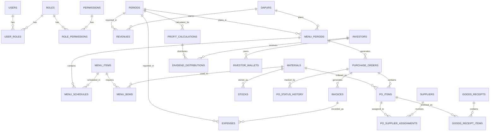
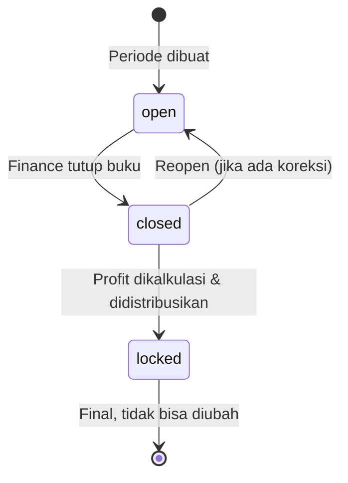
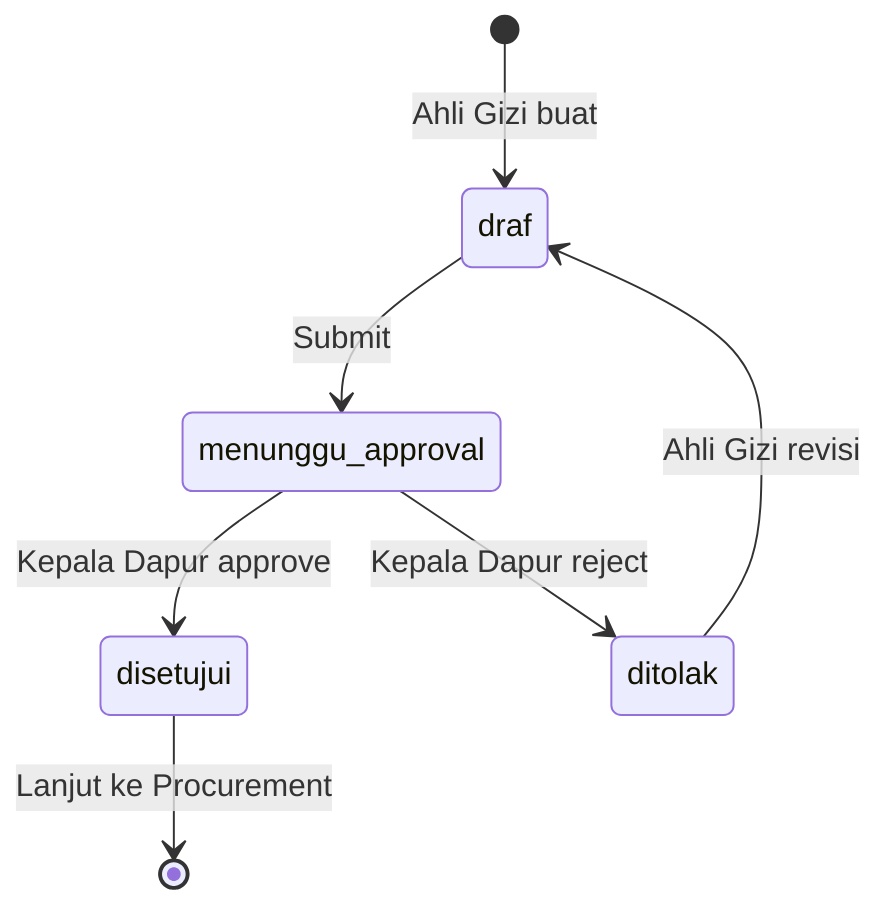
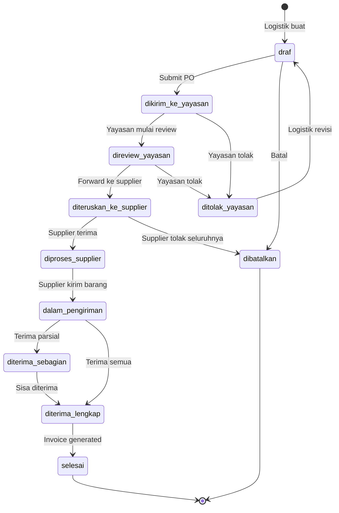
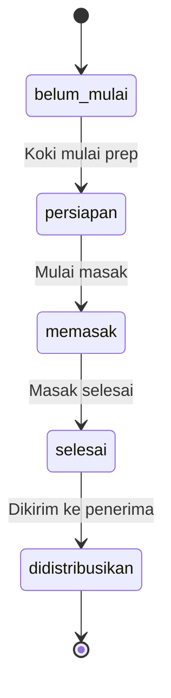
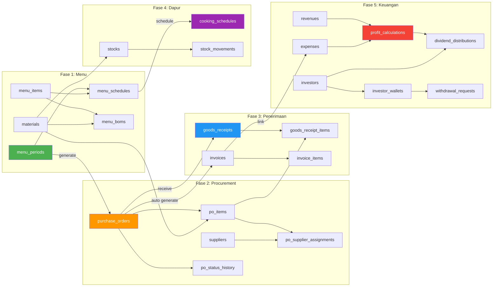

# 📊 Database Schema — Sistem ERP Yayasan MBG

> Dokumen ini merancang seluruh struktur database dari hulu (perencanaan menu) hingga hilir (keuangan & bagi hasil).

---

## Daftar Modul

| # | Modul | Jumlah Tabel | Deskripsi |
|---|-------|-------------|-----------|
| 1 | [Core & RBAC](#1-core--rbac) | 5 | Autentikasi, role, permission |
| 2 | [Organisasi](#2-organisasi) | 5 | Dapur, Supplier, Investor, Periode |
| 3 | [Perencanaan Menu & Gizi](#3-perencanaan-menu--gizi) | 5 | Menu, BOM, nutrisi, approval |
| 4 | [Procurement / PO](#4-procurement--purchase-order) | 5 | Purchase Order, state machine |
| 5 | [Penerimaan Barang & Invoice](#5-penerimaan-barang--invoicing) | 4 | Goods Receipt, QC, Invoice |
| 6 | [Operasional Dapur](#6-operasional-dapur) | 3 | Jadwal masak, stok gudang |
| 7 | [Keuangan & Bagi Hasil](#7-keuangan--bagi-hasil) | 6 | Pendapatan, laba, dividen, wallet |

---

## ERD Overview (Simplified)



---

## 1. Core & RBAC

### 1.1 `users`

| Kolom | Tipe | Constraint | Keterangan |
|-------|------|-----------|------------|
| `id` | `BIGINT UNSIGNED` | PK, AUTO_INCREMENT | |
| `uuid` | `CHAR(36)` | UNIQUE, NOT NULL | Public identifier |
| `name` | `VARCHAR(100)` | NOT NULL | |
| `email` | `VARCHAR(150)` | UNIQUE, NOT NULL | |
| `password` | `VARCHAR(255)` | NOT NULL | Bcrypt hash |
| `phone` | `VARCHAR(20)` | NULLABLE | |
| `avatar` | `VARCHAR(255)` | NULLABLE | Path foto profil |
| `dapur_id` | `BIGINT UNSIGNED` | FK → `dapurs.id`, NULLABLE | NULL jika bukan staf dapur |
| `supplier_id` | `BIGINT UNSIGNED` | FK → `suppliers.id`, NULLABLE | NULL jika bukan supplier |
| `is_active` | `BOOLEAN` | DEFAULT `true` | Soft disable |
| `email_verified_at` | `TIMESTAMP` | NULLABLE | |
| `remember_token` | `VARCHAR(100)` | NULLABLE | |
| `last_login_at` | `TIMESTAMP` | NULLABLE | |
| `created_at` | `TIMESTAMP` | | |
| `updated_at` | `TIMESTAMP` | | |
| `deleted_at` | `TIMESTAMP` | NULLABLE | Soft delete |

> **Index:** `idx_users_email`, `idx_users_dapur`, `idx_users_supplier`

---

### 1.2 `roles`

| Kolom | Tipe | Constraint | Keterangan |
|-------|------|-----------|------------|
| `id` | `BIGINT UNSIGNED` | PK, AUTO_INCREMENT | |
| `name` | `VARCHAR(50)` | UNIQUE, NOT NULL | Slug: `ahli_gizi`, `kepala_dapur`, `logistik`, `admin_yayasan`, `finance_yayasan`, `supplier`, `investor` |
| `display_name` | `VARCHAR(100)` | NOT NULL | Label tampilan |
| `description` | `TEXT` | NULLABLE | |
| `created_at` | `TIMESTAMP` | | |
| `updated_at` | `TIMESTAMP` | | |

**Enum Role yang direncanakan:**

```
ahli_gizi        → Merancang menu & gizi
kepala_dapur     → Approve/reject rancangan menu
logistik         → Kelola stok, generate PO, terima barang
koki             → Eksekusi masak harian
admin_yayasan    → Review & forward PO ke supplier
finance_yayasan  → Kelola keuangan, kalkulasi bagi hasil
supplier         → Terima PO, kirim barang
investor         → Dashboard performa, withdrawal
superadmin       → Full access
```

---

### 1.3 `permissions`

| Kolom | Tipe | Constraint | Keterangan |
|-------|------|-----------|------------|
| `id` | `BIGINT UNSIGNED` | PK, AUTO_INCREMENT | |
| `name` | `VARCHAR(100)` | UNIQUE, NOT NULL | Contoh: `menu.create`, `po.approve`, `finance.view` |
| `display_name` | `VARCHAR(150)` | NOT NULL | |
| `module` | `VARCHAR(50)` | NOT NULL | Group: `menu`, `po`, `warehouse`, `finance` |
| `created_at` | `TIMESTAMP` | | |
| `updated_at` | `TIMESTAMP` | | |

---

### 1.4 `role_permissions`

| Kolom | Tipe | Constraint |
|-------|------|-----------|
| `role_id` | `BIGINT UNSIGNED` | FK → `roles.id`, PK |
| `permission_id` | `BIGINT UNSIGNED` | FK → `permissions.id`, PK |

> **Composite PK:** (`role_id`, `permission_id`)

---

### 1.5 `user_roles`

| Kolom | Tipe | Constraint |
|-------|------|-----------|
| `user_id` | `BIGINT UNSIGNED` | FK → `users.id`, PK |
| `role_id` | `BIGINT UNSIGNED` | FK → `roles.id`, PK |
| `assigned_at` | `TIMESTAMP` | DEFAULT `CURRENT_TIMESTAMP` |

> **Composite PK:** (`user_id`, `role_id`)

---

## 2. Organisasi

### 2.1 `dapurs`

| Kolom | Tipe | Constraint | Keterangan |
|-------|------|-----------|------------|
| `id` | `BIGINT UNSIGNED` | PK, AUTO_INCREMENT | |
| `code` | `VARCHAR(20)` | UNIQUE, NOT NULL | Kode dapur: `DPR-JKT-001` |
| `name` | `VARCHAR(150)` | NOT NULL | Nama dapur |
| `address` | `TEXT` | NULLABLE | Alamat lengkap |
| `city` | `VARCHAR(100)` | NULLABLE | |
| `province` | `VARCHAR(100)` | NULLABLE | |
| `capacity_portions` | `INT UNSIGNED` | NOT NULL | Kapasitas porsi per hari |
| `is_active` | `BOOLEAN` | DEFAULT `true` | |
| `created_at` | `TIMESTAMP` | | |
| `updated_at` | `TIMESTAMP` | | |
| `deleted_at` | `TIMESTAMP` | NULLABLE | |

---

### 2.2 `suppliers`

| Kolom | Tipe | Constraint | Keterangan |
|-------|------|-----------|------------|
| `id` | `BIGINT UNSIGNED` | PK, AUTO_INCREMENT | |
| `code` | `VARCHAR(20)` | UNIQUE, NOT NULL | Kode supplier: `SUP-001` |
| `name` | `VARCHAR(150)` | NOT NULL | Nama perusahaan/mitra |
| `contact_person` | `VARCHAR(100)` | NULLABLE | |
| `phone` | `VARCHAR(20)` | NULLABLE | |
| `email` | `VARCHAR(150)` | NULLABLE | |
| `address` | `TEXT` | NULLABLE | |
| `bank_name` | `VARCHAR(100)` | NULLABLE | Untuk pembayaran |
| `bank_account` | `VARCHAR(50)` | NULLABLE | |
| `bank_holder` | `VARCHAR(100)` | NULLABLE | |
| `category` | `ENUM('sayuran','daging','bumbu','sembako','lainnya')` | NOT NULL | Kategori utama supplier |
| `is_active` | `BOOLEAN` | DEFAULT `true` | |
| `created_at` | `TIMESTAMP` | | |
| `updated_at` | `TIMESTAMP` | | |
| `deleted_at` | `TIMESTAMP` | NULLABLE | |

---

### 2.3 `investors`

| Kolom | Tipe | Constraint | Keterangan |
|-------|------|-----------|------------|
| `id` | `BIGINT UNSIGNED` | PK, AUTO_INCREMENT | |
| `user_id` | `BIGINT UNSIGNED` | FK → `users.id`, UNIQUE | Link ke akun login |
| `code` | `VARCHAR(20)` | UNIQUE, NOT NULL | `INV-001` |
| `name` | `VARCHAR(150)` | NOT NULL | Nama investor |
| `identity_number` | `VARCHAR(30)` | NULLABLE | NIK/KTP |
| `share_percentage` | `DECIMAL(8,4)` | NOT NULL | % kepemilikan saham (misal: `25.0000`) |
| `join_date` | `DATE` | NOT NULL | Tanggal bergabung |
| `exit_date` | `DATE` | NULLABLE | Tanggal keluar (jika ada) |
| `bank_name` | `VARCHAR(100)` | NULLABLE | |
| `bank_account` | `VARCHAR(50)` | NULLABLE | |
| `bank_holder` | `VARCHAR(100)` | NULLABLE | |
| `is_active` | `BOOLEAN` | DEFAULT `true` | |
| `created_at` | `TIMESTAMP` | | |
| `updated_at` | `TIMESTAMP` | | |

> [!IMPORTANT]
> `SUM(share_percentage)` dari semua investor aktif harus selalu = `100.0000`. Validasi ini wajib dilakukan di level aplikasi saat menambah/mengubah investor.

---

### 2.4 `periods` (Master Periode Laporan)

| Kolom | Tipe | Constraint | Keterangan |
|-------|------|-----------|------------|
| `id` | `BIGINT UNSIGNED` | PK, AUTO_INCREMENT | |
| `code` | `VARCHAR(10)` | UNIQUE, NOT NULL | Format: `2026-03` |
| `name` | `VARCHAR(100)` | NOT NULL | "Maret 2026" |
| `month` | `TINYINT UNSIGNED` | NOT NULL | 1-12 |
| `year` | `SMALLINT UNSIGNED` | NOT NULL | 2026 |
| `start_date` | `DATE` | NOT NULL | Awal periode (misal: 2026-03-01) |
| `end_date` | `DATE` | NOT NULL | Akhir periode (misal: 2026-03-31) |
| `status` | `ENUM('open','closed','locked')` | DEFAULT `'open'` | |
| `closed_at` | `TIMESTAMP` | NULLABLE | Waktu periode ditutup |
| `closed_by` | `BIGINT UNSIGNED` | FK → `users.id`, NULLABLE | Finance yang menutup |
| `created_at` | `TIMESTAMP` | | |
| `updated_at` | `TIMESTAMP` | | |

> **Unique:** (`year`, `month`)

> [!IMPORTANT]
> Periode dengan status `closed` tidak bisa menerima transaksi baru (revenue/expense). Status `locked` berarti kalkulasi profit sudah final dan tidak bisa diubah sama sekali.

**State Machine Periode:**



---

### 2.5 `notifications`

| Kolom | Tipe | Constraint | Keterangan |
|-------|------|-----------|------------|
| `id` | `CHAR(36)` | PK | UUID |
| `type` | `VARCHAR(255)` | NOT NULL | Class notifikasi |
| `notifiable_type` | `VARCHAR(255)` | NOT NULL | Polymorphic (User, etc) |
| `notifiable_id` | `BIGINT UNSIGNED` | NOT NULL | |
| `data` | `JSON` | NOT NULL | Payload notifikasi |
| `read_at` | `TIMESTAMP` | NULLABLE | |
| `created_at` | `TIMESTAMP` | | |
| `updated_at` | `TIMESTAMP` | | |

> **Index:** `idx_notifiable` (`notifiable_type`, `notifiable_id`), `idx_read_at`

---

## 3. Perencanaan Menu & Gizi

### 3.1 `materials` (Master Bahan Baku)

| Kolom | Tipe | Constraint | Keterangan |
|-------|------|-----------|------------|
| `id` | `BIGINT UNSIGNED` | PK, AUTO_INCREMENT | |
| `code` | `VARCHAR(30)` | UNIQUE, NOT NULL | `MTR-SAY-001` |
| `name` | `VARCHAR(150)` | NOT NULL | Nama bahan: "Beras Premium" |
| `category` | `ENUM('sayuran','daging','ikan','bumbu','sembako','minuman','lainnya')` | NOT NULL | |
| `unit` | `VARCHAR(20)` | NOT NULL | Satuan: `kg`, `liter`, `butir`, `ikat` |
| `price_estimate` | `DECIMAL(15,2)` | DEFAULT `0` | Harga estimasi per unit |
| `min_stock_threshold` | `DECIMAL(12,3)` | DEFAULT `0` | Batas minimum stok |
| `is_active` | `BOOLEAN` | DEFAULT `true` | |
| `created_at` | `TIMESTAMP` | | |
| `updated_at` | `TIMESTAMP` | | |

---

### 3.2 `menu_periods` (Periode Perencanaan)

| Kolom | Tipe | Constraint | Keterangan |
|-------|------|-----------|------------|
| `id` | `BIGINT UNSIGNED` | PK, AUTO_INCREMENT | |
| `dapur_id` | `BIGINT UNSIGNED` | FK → `dapurs.id`, NOT NULL | |
| `period_id` | `BIGINT UNSIGNED` | FK → `periods.id`, NOT NULL | Periode keuangan (misal: Maret 2026) |
| `title` | `VARCHAR(150)` | NOT NULL | "Menu Minggu ke-3 Maret 2026" |
| `status` | `ENUM('draf','menunggu_approval','disetujui','ditolak')` | DEFAULT `'draf'` | |
| `created_by` | `BIGINT UNSIGNED` | FK → `users.id` | Ahli Gizi |
| `approved_by` | `BIGINT UNSIGNED` | FK → `users.id`, NULLABLE | Kepala Dapur |
| `approved_at` | `TIMESTAMP` | NULLABLE | |
| `rejection_note` | `TEXT` | NULLABLE | Catatan jika ditolak |
| `created_at` | `TIMESTAMP` | | |
| `updated_at` | `TIMESTAMP` | | |

> **Index:** `idx_period_dapur` (`dapur_id`, `period_id`)

**State Machine:**



---

### 3.3 `menu_items` (Item Menu / Resep)

| Kolom | Tipe | Constraint | Keterangan |
|-------|------|-----------|------------|
| `id` | `BIGINT UNSIGNED` | PK, AUTO_INCREMENT | |
| `name` | `VARCHAR(150)` | NOT NULL | "Nasi Goreng Spesial" |
| `description` | `TEXT` | NULLABLE | Deskripsi resep |
| `meal_type` | `ENUM('sarapan','makan_siang','makan_malam','snack')` | NOT NULL | |
| `portion_size` | `VARCHAR(50)` | NULLABLE | "250 gram" |
| `calories` | `DECIMAL(8,2)` | NULLABLE | Total kalori |
| `protein` | `DECIMAL(8,2)` | NULLABLE | Gram protein |
| `carbs` | `DECIMAL(8,2)` | NULLABLE | Gram karbohidrat |
| `fat` | `DECIMAL(8,2)` | NULLABLE | Gram lemak |
| `fiber` | `DECIMAL(8,2)` | NULLABLE | Gram serat |
| `image` | `VARCHAR(255)` | NULLABLE | Foto menu |
| `created_by` | `BIGINT UNSIGNED` | FK → `users.id` | Ahli Gizi |
| `created_at` | `TIMESTAMP` | | |
| `updated_at` | `TIMESTAMP` | | |

---

### 3.4 `menu_boms` (Bill of Materials — Resep Bahan)

| Kolom | Tipe | Constraint | Keterangan |
|-------|------|-----------|------------|
| `id` | `BIGINT UNSIGNED` | PK, AUTO_INCREMENT | |
| `menu_item_id` | `BIGINT UNSIGNED` | FK → `menu_items.id`, NOT NULL | |
| `material_id` | `BIGINT UNSIGNED` | FK → `materials.id`, NOT NULL | |
| `quantity_per_portion` | `DECIMAL(12,4)` | NOT NULL | Takaran per porsi |
| `unit` | `VARCHAR(20)` | NOT NULL | Satuan |
| `notes` | `VARCHAR(255)` | NULLABLE | "Potong dadu kecil" |
| `created_at` | `TIMESTAMP` | | |
| `updated_at` | `TIMESTAMP` | | |

> **Unique:** (`menu_item_id`, `material_id`)

---

### 3.5 `menu_schedules` (Jadwal Menu Harian)

| Kolom | Tipe | Constraint | Keterangan |
|-------|------|-----------|------------|
| `id` | `BIGINT UNSIGNED` | PK, AUTO_INCREMENT | |
| `menu_period_id` | `BIGINT UNSIGNED` | FK → `menu_periods.id`, NOT NULL | |
| `menu_item_id` | `BIGINT UNSIGNED` | FK → `menu_items.id`, NOT NULL | |
| `serve_date` | `DATE` | NOT NULL | Tanggal sajikan |
| `meal_type` | `ENUM('sarapan','makan_siang','makan_malam','snack')` | NOT NULL | |
| `target_portions` | `INT UNSIGNED` | NOT NULL | Jumlah porsi target |
| `notes` | `TEXT` | NULLABLE | |
| `created_at` | `TIMESTAMP` | | |
| `updated_at` | `TIMESTAMP` | | |

> **Unique:** (`menu_period_id`, `serve_date`, `meal_type`)
> **Index:** `idx_schedule_date` (`serve_date`)

---

## 4. Procurement / Purchase Order

> [!WARNING]
> Modul ini adalah yang paling kompleks. Perhatikan baik-baik state machine PO dan relasi antar tabel.

### 4.1 `purchase_orders`

| Kolom | Tipe | Constraint | Keterangan |
|-------|------|-----------|------------|
| `id` | `BIGINT UNSIGNED` | PK, AUTO_INCREMENT | |
| `po_number` | `VARCHAR(30)` | UNIQUE, NOT NULL | Auto-generate: `PO-DPR001-20260330-001` |
| `dapur_id` | `BIGINT UNSIGNED` | FK → `dapurs.id`, NOT NULL | Dapur pemohon |
| `menu_period_id` | `BIGINT UNSIGNED` | FK → `menu_periods.id`, NULLABLE | Referensi menu |
| `status` | `ENUM('draf','dikirim_ke_yayasan','direview_yayasan','diteruskan_ke_supplier','diproses_supplier','dalam_pengiriman','diterima_sebagian','diterima_lengkap','ditolak_yayasan','dibatalkan','selesai')` | DEFAULT `'draf'` | |
| `total_estimated_cost` | `DECIMAL(18,2)` | DEFAULT `0` | Total estimasi biaya |
| `total_actual_cost` | `DECIMAL(18,2)` | DEFAULT `0` | Total biaya aktual (setelah invoice) |
| `notes` | `TEXT` | NULLABLE | |
| `cancellation_reason` | `TEXT` | NULLABLE | Wajib diisi jika dibatalkan |
| `created_by` | `BIGINT UNSIGNED` | FK → `users.id` | Logistik |
| `submitted_at` | `TIMESTAMP` | NULLABLE | Waktu dikirim ke Yayasan |
| `created_at` | `TIMESTAMP` | | |
| `updated_at` | `TIMESTAMP` | | |

---

### 4.2 `po_items` (Item PO)

| Kolom | Tipe | Constraint | Keterangan |
|-------|------|-----------|------------|
| `id` | `BIGINT UNSIGNED` | PK, AUTO_INCREMENT | |
| `purchase_order_id` | `BIGINT UNSIGNED` | FK → `purchase_orders.id`, NOT NULL | |
| `material_id` | `BIGINT UNSIGNED` | FK → `materials.id`, NOT NULL | |
| `quantity_needed` | `DECIMAL(12,3)` | NOT NULL | Kebutuhan dari BOM × porsi |
| `quantity_in_stock` | `DECIMAL(12,3)` | DEFAULT `0` | Stok saat ini di gudang |
| `quantity_to_order` | `DECIMAL(12,3)` | NOT NULL | = `quantity_needed - quantity_in_stock` |
| `unit` | `VARCHAR(20)` | NOT NULL | |
| `estimated_unit_price` | `DECIMAL(15,2)` | DEFAULT `0` | Harga estimasi per unit |
| `actual_unit_price` | `DECIMAL(15,2)` | NULLABLE | Harga aktual dari supplier |
| `quantity_received` | `DECIMAL(12,3)` | DEFAULT `0` | Jumlah yang sudah diterima |
| `item_status` | `ENUM('pending','diteruskan','diterima_supplier','ditolak_supplier','dikirim','diterima_gudang','retur')` | DEFAULT `'pending'` | Status per item |
| `rejection_reason` | `TEXT` | NULLABLE | Alasan supplier menolak |
| `created_at` | `TIMESTAMP` | | |
| `updated_at` | `TIMESTAMP` | | |

> **Index:** `idx_po_items_po` (`purchase_order_id`), `idx_po_items_material` (`material_id`)

---

### 4.3 `po_supplier_assignments` (Distribusi PO ke Supplier)

| Kolom | Tipe | Constraint | Keterangan |
|-------|------|-----------|------------|
| `id` | `BIGINT UNSIGNED` | PK, AUTO_INCREMENT | |
| `po_item_id` | `BIGINT UNSIGNED` | FK → `po_items.id`, NOT NULL | |
| `supplier_id` | `BIGINT UNSIGNED` | FK → `suppliers.id`, NOT NULL | |
| `assigned_by` | `BIGINT UNSIGNED` | FK → `users.id` | Admin Yayasan |
| `quantity_assigned` | `DECIMAL(12,3)` | NOT NULL | Qty yang ditugaskan ke supplier ini |
| `unit_price_agreed` | `DECIMAL(15,2)` | NULLABLE | Harga disepakati |
| `status` | `ENUM('diteruskan','diterima','ditolak','diproses','dikirim','selesai')` | DEFAULT `'diteruskan'` | |
| `rejection_reason` | `TEXT` | NULLABLE | |
| `responded_at` | `TIMESTAMP` | NULLABLE | Waktu supplier merespon |
| `shipped_at` | `TIMESTAMP` | NULLABLE | Waktu pengiriman |
| `created_at` | `TIMESTAMP` | | |
| `updated_at` | `TIMESTAMP` | | |

> [!NOTE]
> Satu `po_item` bisa di-*split* ke beberapa supplier. Misal: kebutuhan 100 kg beras bisa dibagi 60 kg ke Supplier A dan 40 kg ke Supplier B.

---

### 4.4 `po_status_history` (Audit Trail / Event Sourcing)

| Kolom | Tipe | Constraint | Keterangan |
|-------|------|-----------|------------|
| `id` | `BIGINT UNSIGNED` | PK, AUTO_INCREMENT | |
| `purchase_order_id` | `BIGINT UNSIGNED` | FK → `purchase_orders.id`, NOT NULL | |
| `from_status` | `VARCHAR(50)` | NULLABLE | Status sebelumnya (NULL jika baru dibuat) |
| `to_status` | `VARCHAR(50)` | NOT NULL | Status tujuan |
| `changed_by` | `BIGINT UNSIGNED` | FK → `users.id`, NOT NULL | Siapa yang mengubah |
| `reason` | `TEXT` | NULLABLE | Alasan perubahan status |
| `metadata` | `JSON` | NULLABLE | Data tambahan (misal: item yang ditolak) |
| `ip_address` | `VARCHAR(45)` | NULLABLE | |
| `created_at` | `TIMESTAMP` | NOT NULL | Waktu perubahan |

> **Index:** `idx_po_history_po` (`purchase_order_id`), `idx_po_history_date` (`created_at`)

**State Machine PO (Lengkap):**



---

### 4.5 `po_item_sub_suppliers` (Referensi Harga Sub-Supplier)

| Kolom | Tipe | Constraint | Keterangan |
|-------|------|-----------|------------|
| `id` | `BIGINT UNSIGNED` | PK, AUTO_INCREMENT | |
| `po_supplier_assignment_id` | `BIGINT UNSIGNED` | FK → `po_supplier_assignments.id` | |
| `sub_supplier_name` | `VARCHAR(150)` | NOT NULL | Nama petani/penjual |
| `quantity_sourced` | `DECIMAL(12,3)` | NOT NULL | |
| `buying_price` | `DECIMAL(15,2)` | NOT NULL | Harga beli dari sub-supplier |
| `notes` | `TEXT` | NULLABLE | |
| `created_at` | `TIMESTAMP` | | |
| `updated_at` | `TIMESTAMP` | | |

> [!TIP]
> Tabel ini opsional, digunakan jika Mitra Supplier ingin mencatat dari mana mereka sourcing barang (petani, penjual, dll) untuk transparansi.

---

## 5. Penerimaan Barang & Invoicing

### 5.1 `goods_receipts` (Penerimaan Barang - Header)

| Kolom | Tipe | Constraint | Keterangan |
|-------|------|-----------|------------|
| `id` | `BIGINT UNSIGNED` | PK, AUTO_INCREMENT | |
| `gr_number` | `VARCHAR(30)` | UNIQUE, NOT NULL | `GR-DPR001-20260330-001` |
| `purchase_order_id` | `BIGINT UNSIGNED` | FK → `purchase_orders.id`, NOT NULL | |
| `dapur_id` | `BIGINT UNSIGNED` | FK → `dapurs.id`, NOT NULL | |
| `received_by` | `BIGINT UNSIGNED` | FK → `users.id`, NOT NULL | Logistik penerima |
| `received_at` | `TIMESTAMP` | NOT NULL | |
| `status` | `ENUM('draf','selesai')` | DEFAULT `'draf'` | |
| `notes` | `TEXT` | NULLABLE | Catatan umum penerimaan |
| `created_at` | `TIMESTAMP` | | |
| `updated_at` | `TIMESTAMP` | | |

---

### 5.2 `goods_receipt_items` (Detail Penerimaan + QC)

| Kolom | Tipe | Constraint | Keterangan |
|-------|------|-----------|------------|
| `id` | `BIGINT UNSIGNED` | PK, AUTO_INCREMENT | |
| `goods_receipt_id` | `BIGINT UNSIGNED` | FK → `goods_receipts.id`, NOT NULL | |
| `po_item_id` | `BIGINT UNSIGNED` | FK → `po_items.id`, NOT NULL | |
| `po_supplier_assignment_id` | `BIGINT UNSIGNED` | FK → `po_supplier_assignments.id`, NULLABLE | |
| `quantity_received` | `DECIMAL(12,3)` | NOT NULL | Qty yang diterima |
| `quantity_rejected` | `DECIMAL(12,3)` | DEFAULT `0` | Qty ditolak (rusak/retur) |
| `qc_status` | `ENUM('sesuai','kurang','rusak','retur')` | NOT NULL | Hasil quality control |
| `qc_notes` | `TEXT` | NULLABLE | Detail kondisi barang |
| `qc_photo` | `VARCHAR(255)` | NULLABLE | Foto bukti jika rusak |
| `created_at` | `TIMESTAMP` | | |
| `updated_at` | `TIMESTAMP` | | |

---

### 5.3 `invoices` (Tagihan Otomatis)

| Kolom | Tipe | Constraint | Keterangan |
|-------|------|-----------|------------|
| `id` | `BIGINT UNSIGNED` | PK, AUTO_INCREMENT | |
| `invoice_number` | `VARCHAR(30)` | UNIQUE, NOT NULL | `INV-20260330-001` |
| `purchase_order_id` | `BIGINT UNSIGNED` | FK → `purchase_orders.id`, NOT NULL | |
| `supplier_id` | `BIGINT UNSIGNED` | FK → `suppliers.id`, NOT NULL | |
| `dapur_id` | `BIGINT UNSIGNED` | FK → `dapurs.id`, NOT NULL | |
| `subtotal` | `DECIMAL(18,2)` | NOT NULL | Total sebelum pajak |
| `tax_amount` | `DECIMAL(18,2)` | DEFAULT `0` | PPN jika ada |
| `total_amount` | `DECIMAL(18,2)` | NOT NULL | Grand total |
| `status` | `ENUM('generated','diverifikasi','dibayar','dibatalkan')` | DEFAULT `'generated'` | |
| `due_date` | `DATE` | NULLABLE | Jatuh tempo pembayaran |
| `paid_at` | `TIMESTAMP` | NULLABLE | |
| `paid_by` | `BIGINT UNSIGNED` | FK → `users.id`, NULLABLE | Finance Yayasan |
| `payment_proof` | `VARCHAR(255)` | NULLABLE | Bukti transfer |
| `payment_method` | `ENUM('transfer_bank','cash','e_wallet')` | NULLABLE | |
| `notes` | `TEXT` | NULLABLE | |
| `created_at` | `TIMESTAMP` | | |
| `updated_at` | `TIMESTAMP` | | |

> [!IMPORTANT]
> Invoice di-*generate* secara **otomatis** ketika semua item PO pada satu supplier sudah berstatus `diterima_gudang`. Trigger ini dijalankan di level aplikasi (bukan DB trigger) untuk maintainability.

---

### 5.4 `invoice_items`

| Kolom | Tipe | Constraint | Keterangan |
|-------|------|-----------|------------|
| `id` | `BIGINT UNSIGNED` | PK, AUTO_INCREMENT | |
| `invoice_id` | `BIGINT UNSIGNED` | FK → `invoices.id`, NOT NULL | |
| `po_item_id` | `BIGINT UNSIGNED` | FK → `po_items.id`, NOT NULL | |
| `material_id` | `BIGINT UNSIGNED` | FK → `materials.id`, NOT NULL | |
| `quantity` | `DECIMAL(12,3)` | NOT NULL | Qty yang diterima & ditagihkan |
| `unit_price` | `DECIMAL(15,2)` | NOT NULL | Harga per unit |
| `total_price` | `DECIMAL(18,2)` | NOT NULL | = `quantity × unit_price` |
| `created_at` | `TIMESTAMP` | | |
| `updated_at` | `TIMESTAMP` | | |

---

## 6. Operasional Dapur

### 6.1 `stocks` (Stok Gudang Dapur)

| Kolom | Tipe | Constraint | Keterangan |
|-------|------|-----------|------------|
| `id` | `BIGINT UNSIGNED` | PK, AUTO_INCREMENT | |
| `dapur_id` | `BIGINT UNSIGNED` | FK → `dapurs.id`, NOT NULL | |
| `material_id` | `BIGINT UNSIGNED` | FK → `materials.id`, NOT NULL | |
| `current_quantity` | `DECIMAL(12,3)` | DEFAULT `0` | Stok saat ini |
| `unit` | `VARCHAR(20)` | NOT NULL | |
| `last_restocked_at` | `TIMESTAMP` | NULLABLE | Terakhir di-*restock* |
| `updated_at` | `TIMESTAMP` | | |

> **Unique:** (`dapur_id`, `material_id`)

---

### 6.2 `stock_movements` (Mutasi Stok)

| Kolom | Tipe | Constraint | Keterangan |
|-------|------|-----------|------------|
| `id` | `BIGINT UNSIGNED` | PK, AUTO_INCREMENT | |
| `stock_id` | `BIGINT UNSIGNED` | FK → `stocks.id`, NOT NULL | |
| `type` | `ENUM('masuk','keluar','penyesuaian','retur')` | NOT NULL | |
| `quantity` | `DECIMAL(12,3)` | NOT NULL | Jumlah (positif = masuk, negatif = keluar) |
| `reference_type` | `VARCHAR(50)` | NULLABLE | `goods_receipt`, `cooking_schedule`, `adjustment` |
| `reference_id` | `BIGINT UNSIGNED` | NULLABLE | ID dari referensi |
| `notes` | `TEXT` | NULLABLE | |
| `performed_by` | `BIGINT UNSIGNED` | FK → `users.id` | |
| `created_at` | `TIMESTAMP` | | |

> **Index:** `idx_stock_movement_stock` (`stock_id`), `idx_stock_movement_date` (`created_at`)

---

### 6.3 `cooking_schedules` (Jadwal & Status Memasak)

| Kolom | Tipe | Constraint | Keterangan |
|-------|------|-----------|------------|
| `id` | `BIGINT UNSIGNED` | PK, AUTO_INCREMENT | |
| `menu_schedule_id` | `BIGINT UNSIGNED` | FK → `menu_schedules.id`, NOT NULL | |
| `dapur_id` | `BIGINT UNSIGNED` | FK → `dapurs.id`, NOT NULL | |
| `cook_date` | `DATE` | NOT NULL | |
| `assigned_to` | `BIGINT UNSIGNED` | FK → `users.id`, NULLABLE | Koki yang ditugaskan |
| `status` | `ENUM('belum_mulai','persiapan','memasak','selesai','didistribusikan')` | DEFAULT `'belum_mulai'` | |
| `actual_portions` | `INT UNSIGNED` | NULLABLE | Porsi aktual yang dihasilkan |
| `started_at` | `TIMESTAMP` | NULLABLE | |
| `completed_at` | `TIMESTAMP` | NULLABLE | |
| `distributed_at` | `TIMESTAMP` | NULLABLE | |
| `notes` | `TEXT` | NULLABLE | |
| `created_at` | `TIMESTAMP` | | |
| `updated_at` | `TIMESTAMP` | | |

> **Unique:** (`menu_schedule_id`, `dapur_id`)

**State Machine Memasak:**



---

## 7. Keuangan & Bagi Hasil

### 7.1 `revenues` (Pendapatan)

| Kolom | Tipe | Constraint | Keterangan |
|-------|------|-----------|------------|
| `id` | `BIGINT UNSIGNED` | PK, AUTO_INCREMENT | |
| `dapur_id` | `BIGINT UNSIGNED` | FK → `dapurs.id`, NULLABLE | Per dapur atau pusat |
| `period_id` | `BIGINT UNSIGNED` | FK → `periods.id`, NOT NULL | Periode laporan |
| `source` | `ENUM('bgn_pemerintah','donasi','lainnya')` | NOT NULL | Sumber dana |
| `description` | `VARCHAR(255)` | NOT NULL | |
| `amount` | `DECIMAL(18,2)` | NOT NULL | |
| `received_date` | `DATE` | NOT NULL | |
| `proof_document` | `VARCHAR(255)` | NULLABLE | Bukti dokumen |
| `recorded_by` | `BIGINT UNSIGNED` | FK → `users.id` | Finance Yayasan |
| `created_at` | `TIMESTAMP` | | |
| `updated_at` | `TIMESTAMP` | | |

> **Index:** `idx_revenue_period` (`period_id`, `dapur_id`)

---

### 7.2 `expenses` (Beban Operasional)

| Kolom | Tipe | Constraint | Keterangan |
|-------|------|-----------|------------|
| `id` | `BIGINT UNSIGNED` | PK, AUTO_INCREMENT | |
| `dapur_id` | `BIGINT UNSIGNED` | FK → `dapurs.id`, NULLABLE | |
| `period_id` | `BIGINT UNSIGNED` | FK → `periods.id`, NOT NULL | Periode laporan |
| `category` | `ENUM('bahan_baku','gaji','listrik_air','transportasi','peralatan','lainnya')` | NOT NULL | |
| `description` | `VARCHAR(255)` | NOT NULL | |
| `amount` | `DECIMAL(18,2)` | NOT NULL | |
| `invoice_id` | `BIGINT UNSIGNED` | FK → `invoices.id`, NULLABLE | Link otomatis dari invoice supplier |
| `expense_date` | `DATE` | NOT NULL | |
| `proof_document` | `VARCHAR(255)` | NULLABLE | |
| `recorded_by` | `BIGINT UNSIGNED` | FK → `users.id` | |
| `created_at` | `TIMESTAMP` | | |
| `updated_at` | `TIMESTAMP` | | |

---

### 7.3 `profit_calculations` (Kalkulasi Laba Periode)

| Kolom | Tipe | Constraint | Keterangan |
|-------|------|-----------|------------|
| `id` | `BIGINT UNSIGNED` | PK, AUTO_INCREMENT | |
| `period_id` | `BIGINT UNSIGNED` | FK → `periods.id`, UNIQUE, NOT NULL | Periode yang dikalkulasi |
| `total_revenue` | `DECIMAL(18,2)` | NOT NULL | SUM revenues |
| `total_expense` | `DECIMAL(18,2)` | NOT NULL | SUM expenses |
| `gross_profit` | `DECIMAL(18,2)` | NOT NULL | = revenue - expense |
| `yayasan_share_pct` | `DECIMAL(5,2)` | DEFAULT `20.00` | Konfigurabel |
| `investor_share_pct` | `DECIMAL(5,2)` | DEFAULT `80.00` | Konfigurabel |
| `yayasan_amount` | `DECIMAL(18,2)` | NOT NULL | = gross_profit × 20% |
| `investor_pool_amount` | `DECIMAL(18,2)` | NOT NULL | = gross_profit × 80% |
| `status` | `ENUM('draf','dikunci','didistribusikan')` | DEFAULT `'draf'` | |
| `calculated_by` | `BIGINT UNSIGNED` | FK → `users.id` | Finance |
| `locked_at` | `TIMESTAMP` | NULLABLE | Waktu dikunci (tidak bisa diubah) |
| `distributed_at` | `TIMESTAMP` | NULLABLE | Waktu dividen didistribusikan |
| `created_at` | `TIMESTAMP` | | |
| `updated_at` | `TIMESTAMP` | | |

> [!CAUTION]
> Setelah status `dikunci`, data revenue/expense pada periode tersebut **tidak boleh diubah**. Ini dikontrol juga oleh status `locked` pada tabel `periods`. Koreksi harus masuk ke periode berikutnya sebagai adjustment.

**Rumus Kalkulasi:**

```
Gross Profit     = Σ Revenue(period_id) - Σ Expense(period_id)
Bagian Yayasan   = Gross Profit × 20%
Pool Investor    = Gross Profit × 80%
Per Investor     = Pool Investor × (share_percentage / 100)
```

---

### 7.4 `dividend_distributions` (Distribusi Dividen per Investor)

| Kolom | Tipe | Constraint | Keterangan |
|-------|------|-----------|------------|
| `id` | `BIGINT UNSIGNED` | PK, AUTO_INCREMENT | |
| `profit_calculation_id` | `BIGINT UNSIGNED` | FK → `profit_calculations.id`, NOT NULL | |
| `investor_id` | `BIGINT UNSIGNED` | FK → `investors.id`, NOT NULL | |
| `share_percentage` | `DECIMAL(8,4)` | NOT NULL | Snapshot % saham saat distribusi |
| `amount` | `DECIMAL(18,2)` | NOT NULL | = pool × (share_pct / 100) |
| `status` | `ENUM('calculated','credited','withdrawn')` | DEFAULT `'calculated'` | |
| `credited_at` | `TIMESTAMP` | NULLABLE | Waktu masuk ke wallet |
| `created_at` | `TIMESTAMP` | | |
| `updated_at` | `TIMESTAMP` | | |

> **Unique:** (`profit_calculation_id`, `investor_id`)

> [!NOTE]
> Kolom `share_percentage` di sini adalah **snapshot** dari `investors.share_percentage` saat kalkulasi dijalankan. Ini penting agar jika % saham investor berubah di masa depan, histori distribusi tetap akurat.

---

### 7.5 `investor_wallets` (Dompet Digital Investor)

| Kolom | Tipe | Constraint | Keterangan |
|-------|------|-----------|------------|
| `id` | `BIGINT UNSIGNED` | PK, AUTO_INCREMENT | |
| `investor_id` | `BIGINT UNSIGNED` | FK → `investors.id`, UNIQUE | Satu investor = satu wallet |
| `balance` | `DECIMAL(18,2)` | DEFAULT `0` | Saldo saat ini |
| `total_earned` | `DECIMAL(18,2)` | DEFAULT `0` | Total kumulatif yang pernah diterima |
| `total_withdrawn` | `DECIMAL(18,2)` | DEFAULT `0` | Total kumulatif yang pernah ditarik |
| `updated_at` | `TIMESTAMP` | | |

---

### 7.6 `withdrawal_requests` (Penarikan Dana)

| Kolom | Tipe | Constraint | Keterangan |
|-------|------|-----------|------------|
| `id` | `BIGINT UNSIGNED` | PK, AUTO_INCREMENT | |
| `investor_id` | `BIGINT UNSIGNED` | FK → `investors.id`, NOT NULL | |
| `amount` | `DECIMAL(18,2)` | NOT NULL | Jumlah penarikan |
| `bank_name` | `VARCHAR(100)` | NOT NULL | Tujuan transfer |
| `bank_account` | `VARCHAR(50)` | NOT NULL | |
| `bank_holder` | `VARCHAR(100)` | NOT NULL | |
| `status` | `ENUM('pending','diproses','berhasil','ditolak')` | DEFAULT `'pending'` | |
| `processed_by` | `BIGINT UNSIGNED` | FK → `users.id`, NULLABLE | Finance Yayasan |
| `processed_at` | `TIMESTAMP` | NULLABLE | |
| `transfer_proof` | `VARCHAR(255)` | NULLABLE | Bukti transfer |
| `rejection_reason` | `TEXT` | NULLABLE | |
| `created_at` | `TIMESTAMP` | | |
| `updated_at` | `TIMESTAMP` | | |

> **Validasi:** `amount` tidak boleh melebihi `investor_wallets.balance`

---

## Ringkasan Relasi Antar Modul



---

## Catatan Teknis

### Tipe Data Moneter
```sql
-- SELALU gunakan DECIMAL, JANGAN gunakan FLOAT/DOUBLE
DECIMAL(18,2)  -- Untuk amount (max: 9,999,999,999,999,999.99)
DECIMAL(15,2)  -- Untuk harga satuan
DECIMAL(12,3)  -- Untuk quantity (3 desimal untuk kg/liter)
DECIMAL(8,4)   -- Untuk persentase (4 desimal untuk presisi)
```

### Indexing Strategy
```sql
-- Composite index untuk query yang sering digunakan
CREATE INDEX idx_po_dapur_status ON purchase_orders(dapur_id, status);
CREATE INDEX idx_po_period ON purchase_orders(menu_period_id);
CREATE INDEX idx_expense_period ON expenses(period_id, category);
CREATE INDEX idx_revenue_period ON revenues(period_id, dapur_id);
CREATE INDEX idx_cooking_date ON cooking_schedules(cook_date, dapur_id);
```

### Soft Delete
Tabel yang menggunakan `deleted_at` (soft delete):
- `users`
- `dapurs`
- `suppliers`

Tabel transaksional **tidak** menggunakan soft delete — gunakan status `dibatalkan` sebagai gantinya.
