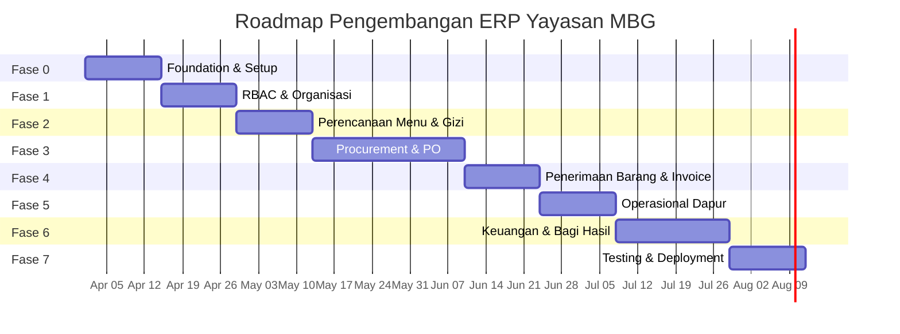
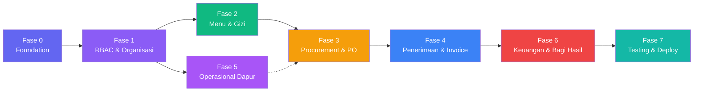

# 🗺️ Roadmap Pengembangan — Sistem ERP Yayasan MBG

> **Tech Stack:** Laravel 11 + Tailwind CSS + MySQL 8  
> **Estimasi Total:** ~16-20 minggu (8-10 sprint × 2 minggu)  
> **Metodologi:** Agile Scrum, sprint 2 minggu

---

## Overview Timeline



---

## Dependency Map Antar Fase



> [!NOTE]
> Fase 5 (Operasional Dapur) bisa dikerjakan **paralel** dengan Fase 3 jika ada 2+ developer, karena dependensinya hanya ke Fase 1 dan 2.

---

## Fase 0 — Foundation & Setup (Sprint 1)

> **Durasi:** 2 minggu  
> **Goal:** Project siap untuk development, infrastruktur berdiri

### 0.1 Project Initialization

| Task | Detail |
|------|--------|
| **Laravel Project** | `composer create-project laravel/laravel .` (Laravel 11) |
| **Tailwind CSS** | Install via Vite: `npm install -D tailwindcss @tailwindcss/forms @tailwindcss/typography` |
| **Database** | Konfigurasi MySQL 8, setup `.env` |
| **Docker** | `docker-compose.yml` (Nginx + PHP 8.4 + MySQL + Redis) |
| **Git** | Init repo, `.gitignore`, `.editorconfig`, branch strategy (`main`, `develop`, `feature/*`) |

### 0.2 Laravel Packages

| Package | Kegunaan |
|---------|----------|
| `spatie/laravel-permission` | Role & Permission management |
| `spatie/laravel-activitylog` | Audit trail semua model |
| `laravel/sanctum` | API authentication |
| `barryvdh/laravel-dompdf` | Generate PDF (invoice, laporan) |
| `maatwebsite/excel` | Export/import Excel |
| `filament/notifications` | Real-time notification system |

### 0.3 Architecture Setup

```
app/
├── Models/            # Eloquent models
├── Http/
│   ├── Controllers/
│   │   ├── Auth/
│   │   ├── Menu/
│   │   ├── Procurement/
│   │   ├── Warehouse/
│   │   ├── Kitchen/
│   │   └── Finance/
│   ├── Middleware/
│   ├── Requests/      # Form validation
│   └── Resources/     # API resources (jika perlu)
├── Services/          # Business logic layer
├── Enums/             # Status enums (PHP 8.1+)
├── Events/            # Event classes
├── Listeners/         # Event listeners
├── Notifications/     # Notification classes
├── Observers/         # Model observers
└── Policies/          # Authorization policies
```

### 0.4 Database Migrations (Semua Tabel)

Buat semua migration berdasarkan [database_schema.md](./database_schema.md) — **urut berdasarkan dependency**:

```
migrations/
├── 01_create_roles_table
├── 02_create_permissions_table
├── 03_create_role_permissions_table
├── 04_create_dapurs_table
├── 05_create_suppliers_table
├── 06_create_periods_table
├── 07_create_users_table            ← FK ke dapurs, suppliers
├── 08_create_user_roles_table
├── 09_create_investors_table        ← FK ke users
├── 10_create_notifications_table
├── 11_create_materials_table
├── 12_create_menu_items_table
├── 13_create_menu_periods_table     ← FK ke dapurs, periods, users
├── 14_create_menu_boms_table
├── 15_create_menu_schedules_table
├── 16_create_purchase_orders_table
├── 17_create_po_items_table
├── 18_create_po_supplier_assignments_table
├── 19_create_po_status_history_table
├── 20_create_po_item_sub_suppliers_table
├── 21_create_goods_receipts_table
├── 22_create_goods_receipt_items_table
├── 23_create_invoices_table
├── 24_create_invoice_items_table
├── 25_create_stocks_table
├── 26_create_stock_movements_table
├── 27_create_cooking_schedules_table
├── 28_create_revenues_table
├── 29_create_expenses_table
├── 30_create_profit_calculations_table
├── 31_create_dividend_distributions_table
├── 32_create_investor_wallets_table
└── 33_create_withdrawal_requests_table
```

### 0.5 Seeders

| Seeder | Data |
|--------|------|
| `RoleSeeder` | 9 roles (ahli_gizi, kepala_dapur, logistik, koki, admin_yayasan, finance_yayasan, supplier, investor, superadmin) |
| `PermissionSeeder` | Semua permissions per module |
| `PeriodSeeder` | Periode 12 bulan tahun berjalan |
| `DapurSeeder` | 2-3 dapur dummy |
| `UserSeeder` | 1 user per role untuk testing |
| `MaterialSeeder` | 20-30 bahan baku umum |

### ✅ Milestone Fase 0

- [ ] `php artisan migrate` sukses tanpa error
- [ ] `php artisan db:seed` mengisi data awal
- [ ] Login/register berfungsi
- [ ] Tailwind CSS ter-compile via Vite
- [ ] Docker environment berjalan

---

## Fase 1 — RBAC & Organisasi (Sprint 2)

> **Durasi:** 2 minggu  
> **Dependency:** Fase 0  
> **Tabel:** `users`, `roles`, `permissions`, `role_permissions`, `user_roles`, `dapurs`, `suppliers`, `investors`, `periods`, `notifications`

### 1.1 Autentikasi & RBAC

| Task | Detail |
|------|--------|
| Login / Logout | Laravel Breeze atau manual + Tailwind |
| Middleware `role` | Cek role user per route group |
| Middleware `permission` | Cek permission spesifik per action |
| Dashboard routing | Redirect ke dashboard sesuai role setelah login |
| Profile management | Edit profil, ganti password, upload avatar |

### 1.2 Master Data — Dapur

| Fitur | Detail |
|-------|--------|
| CRUD Dapur | Kode, nama, alamat, kapasitas porsi |
| List dengan filter | Filter by kota, provinsi, status aktif |
| Soft delete | Nonaktifkan dapur tanpa hapus data |

### 1.3 Master Data — Supplier

| Fitur | Detail |
|-------|--------|
| CRUD Supplier | Kode, nama, kontak, bank, kategori |
| List dengan filter | Filter by kategori (sayuran, daging, dll) |
| Detail supplier | Riwayat PO, performa pengiriman |

### 1.4 Master Data — Investor

| Fitur | Detail |
|-------|--------|
| CRUD Investor | Kode, nama, NIK, % saham, bank |
| Validasi share | `SUM(share_percentage)` harus = 100% |
| Auto-create wallet | Otomatis buat `investor_wallets` saat investor baru |

### 1.5 Master Data — Periode

| Fitur | Detail |
|-------|--------|
| CRUD Periode | Code, name, month, year, start/end date |
| Auto-generate | Bisa generate 12 bulan sekaligus |
| Status management | `open` → `closed` → `locked` |
| Validasi | Tidak bisa close jika ada transaksi pending |

### 1.6 Management User

| Fitur | Detail |
|-------|--------|
| CRUD User | Nama, email, role, dapur/supplier assignment |
| Assign role | Multi-role support |
| Aktivasi/deaktivasi | Toggle `is_active` |

### 1.7 Sistem Notifikasi

| Fitur | Detail |
|-------|--------|
| Database notification | Laravel Notification via database channel |
| Bell icon + badge | Unread count di navbar |
| Mark as read | Klik untuk mark read, tombol "Mark all as read" |

### 1.8 Layout & UI

| Komponen | Detail |
|----------|--------|
| Sidebar navigation | Menu sesuai role (hide menu yang tidak punya akses) |
| Top navbar | User info, notification bell, logout |
| Breadcrumb | Navigasi kontekstual |
| Dashboard per role | Widget/statistik sesuai role |

### ✅ Milestone Fase 1

- [ ] Login → redirect ke dashboard sesuai role
- [ ] CRUD semua master data berfungsi
- [ ] Role-based menu visibility berjalan
- [ ] Notifikasi database tersimpan dan tampil

---

## Fase 2 — Perencanaan Menu & Gizi (Sprint 3)

> **Durasi:** 2 minggu  
> **Dependency:** Fase 1  
> **Tabel:** `materials`, `menu_items`, `menu_boms`, `menu_periods`, `menu_schedules`

### 2.1 Master Bahan Baku (`materials`)

| Fitur | Detail |
|-------|--------|
| CRUD Material | Kode, nama, kategori, satuan, harga estimasi |
| Import Excel | Bulk import bahan baku via file Excel |
| Threshold stok | Set batas minimum untuk alert |

### 2.2 Menu Items / Resep

| Fitur | Detail |
|-------|--------|
| CRUD Menu Item | Nama, deskripsi, tipe makan, foto |
| Input gizi | Kalori, protein, karbo, lemak, serat |
| BOM (Bill of Materials) | Tabel dynamic: pilih material + qty per porsi |
| Kalkulasi otomatis | Total gizi dihitung dari BOM |
| Preview | Tampilan kartu resep lengkap dengan gizi |

### 2.3 Perencanaan Menu Periode

| Fitur | Detail |
|-------|--------|
| Buat rancangan menu | Pilih periode → isi jadwal harian |
| Kalender view | Tampilan kalender: drag & drop menu ke tanggal |
| Target porsi | Input jumlah porsi per jadwal |
| Kalkulasi kebutuhan bahan | Otomatis: BOM × porsi = total kebutuhan bahan |
| Submit untuk approval | Kirim ke Kepala Dapur + notifikasi |

### 2.4 Approval Workflow Menu

| Fitur | Role | Detail |
|-------|------|--------|
| Review menu | Kepala Dapur | Lihat detail menu, gizi, estimasi biaya bahan |
| Approve | Kepala Dapur | Status → `disetujui`, notifikasi ke Logistik |
| Reject + catatan | Kepala Dapur | Status → `ditolak`, wajib isi catatan, notifikasi ke Ahli Gizi |
| Revisi & re-submit | Ahli Gizi | Edit berdasarkan catatan, submit ulang |

### ✅ Milestone Fase 2

- [ ] Ahli Gizi bisa buat rancangan menu + BOM
- [ ] Kepala Dapur bisa approve / reject dengan catatan
- [ ] Kalkulasi total kebutuhan bahan baku otomatis
- [ ] Status flow `draf → menunggu_approval → disetujui/ditolak` berjalan

---

## Fase 3 — Procurement & PO (Sprint 4-5)

> **Durasi:** 4 minggu (modul paling kompleks)  
> **Dependency:** Fase 2  
> **Tabel:** `purchase_orders`, `po_items`, `po_supplier_assignments`, `po_status_history`, `po_item_sub_suppliers`

> [!WARNING]
> Ini adalah modul paling kompleks dengan 11 status PO dan 5 aktor. Alokasi waktu ekstra untuk testing state transitions.

### Sprint 4: PO Creation & Yayasan Review

#### 3.1 Generate PO (Logistik)

| Fitur | Detail |
|-------|--------|
| Auto-pull dari menu | Tarik data kebutuhan bahan dari menu yang di-approve |
| Cek stok gudang | Bandingkan kebutuhan vs stok aktual |
| Generate draf PO | Auto-generate PO dengan item yang perlu dibeli |
| Edit PO | Tambah/hapus/ubah item sebelum submit |
| Submit ke Yayasan | Status → `dikirim_ke_yayasan` + notifikasi |

#### 3.2 Enums & State Machine

```php
// app/Enums/PoStatus.php
enum PoStatus: string
{
    case DRAF = 'draf';
    case DIKIRIM_KE_YAYASAN = 'dikirim_ke_yayasan';
    case DIREVIEW_YAYASAN = 'direview_yayasan';
    case DITERUSKAN_KE_SUPPLIER = 'diteruskan_ke_supplier';
    case DIPROSES_SUPPLIER = 'diproses_supplier';
    case DALAM_PENGIRIMAN = 'dalam_pengiriman';
    case DITERIMA_SEBAGIAN = 'diterima_sebagian';
    case DITERIMA_LENGKAP = 'diterima_lengkap';
    case DITOLAK_YAYASAN = 'ditolak_yayasan';
    case DIBATALKAN = 'dibatalkan';
    case SELESAI = 'selesai';

    // Definisi transisi yang valid
    public function allowedTransitions(): array
    {
        return match($this) {
            self::DRAF => [self::DIKIRIM_KE_YAYASAN, self::DIBATALKAN],
            self::DIKIRIM_KE_YAYASAN => [self::DIREVIEW_YAYASAN, self::DITOLAK_YAYASAN],
            // ...dst
        };
    }
}
```

#### 3.3 Review PO (Admin Yayasan)

| Fitur | Detail |
|-------|--------|
| List PO masuk | Dari semua dapur, filter by status, dapur, tanggal |
| Detail PO | Lihat semua item, estimasi harga, dapur asal |
| Approve & forward | Pilih supplier per item → assign |
| Split item | 1 item bisa di-split ke beberapa supplier |
| Reject + alasan | Tolak PO, wajib isi alasan, notifikasi ke Logistik |
| Audit trail | Setiap aksi tercatat di `po_status_history` |

### Sprint 5: Supplier Response & Tracking

#### 3.4 Respon Supplier

| Fitur | Detail |
|-------|--------|
| List PO masuk | Supplier lihat PO yang ditugaskan ke mereka |
| Terima PO | Konfirmasi harga & ketersediaan |
| Tolak (sebagian/seluruh) | Wajib isi alasan, notifikasi ke Yayasan & Logistik |
| Input harga aktual | Isi harga per item dari sub-supplier |
| Update status pengiriman | Mark sebagai "Diproses" → "Dikirim" |
| Catat sub-supplier | Opsional: input asal barang (petani, dll) |

#### 3.5 PO Tracking Dashboard

| Fitur | Detail |
|-------|--------|
| Timeline PO | Visual timeline status PO dari awal sampai akhir |
| Filter & search | By status, dapur, supplier, tanggal |
| Status badges | Warna berbeda per status |
| History log | Lihat semua perubahan status + siapa + kapan |
| Pembatalan PO | Wajib isi alasan, validasi status boleh dibatalkan |

### ✅ Milestone Fase 3

- [ ] Logistik bisa generate PO otomatis dari menu
- [ ] Yayasan bisa review, assign ke supplier, atau tolak
- [ ] Supplier bisa terima/tolak PO dengan alasan
- [ ] Setiap transisi status tercatat di `po_status_history`
- [ ] State machine mencegah transisi ilegal
- [ ] Notifikasi otomatis di setiap perubahan status

---

## Fase 4 — Penerimaan Barang & Invoicing (Sprint 6)

> **Durasi:** 2 minggu  
> **Dependency:** Fase 3  
> **Tabel:** `goods_receipts`, `goods_receipt_items`, `invoices`, `invoice_items`, `stocks`, `stock_movements`

### 4.1 Penerimaan Barang (Logistik)

| Fitur | Detail |
|-------|--------|
| Buat Goods Receipt | Pilih PO → list item yang dikirim supplier |
| Input qty diterima | Per item: qty diterima vs qty di PO |
| Quality Control | Status QC: sesuai, kurang, rusak, retur |
| Upload foto | Bukti foto jika barang rusak |
| Auto-update stok | Qty yang diterima masuk ke `stocks` + `stock_movements` |
| Penerimaan parsial | Bisa terima sebagian, sisanya nanti |

### 4.2 Auto-Generate Invoice

| Fitur | Detail |
|-------|--------|
| Trigger otomatis | Ketika semua item PO dari 1 supplier berstatus `diterima_gudang` |
| Kalkulasi | Subtotal = Σ(qty_received × actual_unit_price) |
| PPN | Opsional, bisa diset per invoice |
| Invoice number | Auto-generate: `INV-YYYYMMDD-XXX` |
| Auto-create expense | Invoice otomatis tercatat sebagai `expenses` (kategori: bahan_baku) |

### 4.3 Manajemen Invoice (Finance Yayasan)

| Fitur | Detail |
|-------|--------|
| List invoice | Filter by status, supplier, periode |
| Verifikasi | Finance memverifikasi invoice |
| Pembayaran | Input tanggal bayar, metode, bukti transfer |
| Status tracking | `generated → diverifikasi → dibayar` |
| Cetak PDF | Generate invoice PDF untuk arsip |

### ✅ Milestone Fase 4

- [ ] Logistik bisa terima barang + QC
- [ ] Stok gudang otomatis bertambah
- [ ] Invoice auto-generate ketika PO selesai
- [ ] Finance bisa verifikasi dan bayar invoice
- [ ] Expense otomatis tercatat di modul keuangan

---

## Fase 5 — Operasional Dapur (Sprint 7)

> **Durasi:** 2 minggu  
> **Dependency:** Fase 2 (bisa paralel dengan Fase 3-4)  
> **Tabel:** `cooking_schedules`, `stocks`, `stock_movements`

### 5.1 Jadwal Masak Harian

| Fitur | Detail |
|-------|--------|
| Auto-generate dari menu | Buat cooking schedule dari `menu_schedules` yang sudah approve |
| Assign koki | Tugaskan koki ke jadwal masak |
| View harian | Tampilan: hari ini harus masak apa, porsi berapa |
| Cek ketersediaan bahan | Warning jika stok tidak cukup |

### 5.2 Tracking Status Memasak (Koki)

| Fitur | Detail |
|-------|--------|
| UI tablet-friendly | Layout besar, tombol jelas untuk dapur |
| Update status | `belum_mulai → persiapan → memasak → selesai → didistribusikan` |
| Input porsi aktual | Berapa porsi yang benar-benar dihasilkan |
| Timestamp otomatis | `started_at`, `completed_at`, `distributed_at` |

### 5.3 Manajemen Stok

| Fitur | Detail |
|-------|--------|
| Dashboard stok | Per dapur: list bahan + qty + status (aman/rendah/habis) |
| Auto-deduct | Stok berkurang otomatis saat memasak selesai (berdasarkan BOM × porsi aktual) |
| Penyesuaian manual | Logistik bisa adjust stok (audit, rusak, dll) |
| Alert stok rendah | Notifikasi jika stok di bawah threshold |
| Riwayat mutasi | Log semua masuk/keluar stok |

### ✅ Milestone Fase 5

- [ ] Koki bisa lihat jadwal harian dan update status masak
- [ ] Stok otomatis berkurang setelah masak
- [ ] Alert stok rendah berfungsi
- [ ] Riwayat mutasi stok tercatat lengkap

---

## Fase 6 — Keuangan & Bagi Hasil (Sprint 8-9)

> **Durasi:** 3 minggu  
> **Dependency:** Fase 4  
> **Tabel:** `revenues`, `expenses`, `profit_calculations`, `dividend_distributions`, `investor_wallets`, `withdrawal_requests`

### Sprint 8: Pencatatan Keuangan

#### 6.1 Pendapatan (`revenues`)

| Fitur | Detail |
|-------|--------|
| Input pendapatan | Sumber (BGN/Pemerintah, donasi, lainnya), jumlah, tanggal |
| Per periode | Otomatis masuk ke periode yang aktif |
| Upload bukti | Dokumen pendukung |
| Laporan pendapatan | Tabel + grafik per periode, per sumber |

#### 6.2 Beban Operasional (`expenses`)

| Fitur | Detail |
|-------|--------|
| Auto dari invoice | Expense otomatis tercatat dari invoice supplier |
| Input manual | Gaji, listrik/air, transportasi, peralatan, lainnya |
| Per kategori | Breakdown biaya per kategori |
| Laporan beban | Tabel + grafik per periode, per kategori |

#### 6.3 Validasi Periode

| Fitur | Detail |
|-------|--------|
| Close periode | Finance menutup periode → tidak bisa input transaksi baru |
| Reopen | Bisa dibuka ulang jika ada koreksi (sebelum lock) |
| Lock | Setelah profit dikalkulasi & didistribusikan → final |

### Sprint 9: Profit Sharing & Investor Portal

#### 6.4 Kalkulasi Laba & Bagi Hasil

| Fitur | Detail |
|-------|--------|
| Kalkulasi otomatis | Tombol "Hitung Laba Periode" → hitung revenue - expense |
| Preview sebelum lock | Tampilkan breakdown: laba kotor, bagian yayasan (20%), pool investor (80%) |
| Distribusi per investor | Auto-split pool investor berdasarkan % saham |
| Lock & distribute | Kunci kalkulasi + credit ke wallet investor |
| Handling rugi | Jika rugi, tampilkan warning, tidak ada distribusi |

#### 6.5 Dashboard Investor

| Fitur | Detail |
|-------|--------|
| Ringkasan investasi | Total modal, % saham, durasi bergabung |
| Grafik performa | Chart pendapatan dapur, porsi disalurkan per bulan |
| Transparansi keuangan | Lihat ringkasan revenue, expense, profit per periode |
| Riwayat dividen | List semua distribusi yang pernah diterima |
| Saldo wallet | Saldo saat ini, total earned, total withdrawn |

#### 6.6 Withdrawal / Penarikan Dana

| Fitur | Detail |
|-------|--------|
| Request withdrawal | Investor input jumlah + rekening tujuan |
| Validasi saldo | Tidak boleh melebihi saldo wallet |
| Approval finance | Finance memproses, upload bukti transfer |
| Status tracking | `pending → diproses → berhasil / ditolak` |
| Auto-update wallet | Saldo berkurang setelah withdrawal berhasil |

#### 6.7 Laporan Keuangan

| Laporan | Detail |
|---------|--------|
| Laporan Laba Rugi | Per periode: revenue - expense = profit |
| Laporan Distribusi | Per periode: pembagian ke yayasan & tiap investor |
| Laporan Hutang (AP) | Invoice yang belum dibayar |
| Laporan Porsi | Total porsi per dapur per periode |
| Export PDF/Excel | Semua laporan bisa di-download |

### ✅ Milestone Fase 6

- [ ] Finance bisa input revenue & expense manual
- [ ] Expense otomatis dari invoice supplier
- [ ] Kalkulasi profit + distribusi dividen berjalan benar
- [ ] Investor bisa lihat dashboard + request withdrawal
- [ ] Laporan keuangan bisa di-export PDF/Excel
- [ ] Presisi angka DECIMAL(18,2) terverifikasi

---

## Fase 7 — Testing, Polish & Deployment (Sprint 10)

> **Durasi:** 2 minggu  
> **Dependency:** Semua fase

### 7.1 Testing

| Jenis | Scope |
|-------|-------|
| **Unit Test** | Services: kalkulasi BOM, profit sharing, state transitions |
| **Feature Test** | Full flow: buat menu → PO → terima barang → invoice → profit |
| **Integration Test** | State machine PO: semua transisi valid & invalid |
| **UAT** | User Acceptance Testing per role |

### 7.2 Performance & Security

| Task | Detail |
|------|--------|
| Query optimization | N+1 query check, eager loading |
| Indexing review | Pastikan semua index di schema sudah diterapkan |
| CSRF protection | Semua form |
| Authorization check | Pastikan tidak ada endpoint yang bisa diakses tanpa permission |
| Input validation | Semua FormRequest tervalidasi |
| Rate limiting | Untuk API & login |

### 7.3 Deployment

| Task | Detail |
|------|--------|
| Server setup | VPS/Cloud (Ubuntu + Nginx + PHP-FPM + MySQL) |
| SSL | Let's Encrypt / Cloudflare |
| CI/CD | GitHub Actions: test → build → deploy |
| Monitoring | Error tracking (Sentry/Bugsnag) |
| Backup | Automated MySQL backup (daily) |
| Dokumentasi | API docs (jika ada), user guide per role |

### ✅ Milestone Fase 7

- [ ] Test coverage > 80% untuk service layer
- [ ] Full flow test dari menu sampai profit sharing berhasil
- [ ] Zero critical/high security vulnerabilities
- [ ] Deployment ke staging berhasil
- [ ] UAT sign-off dari stakeholder

---

## Ringkasan Sprint

| Sprint | Fase | Durasi | Deliverables Utama |
|--------|------|--------|-------------------|
| 1 | Fase 0 | 2 minggu | Project setup, migrations, seeders, auth |
| 2 | Fase 1 | 2 minggu | RBAC, CRUD master data, notifikasi, layout UI |
| 3 | Fase 2 | 2 minggu | Menu planning, BOM, approval workflow |
| 4 | Fase 3a | 2 minggu | PO creation, Yayasan review, assign supplier |
| 5 | Fase 3b | 2 minggu | Supplier response, PO tracking, state machine |
| 6 | Fase 4 | 2 minggu | Goods receipt, QC, invoice, stok update |
| 7 | Fase 5 | 2 minggu | Cooking schedule, stok management |
| 8 | Fase 6a | 2 minggu | Revenue, expense, laporan keuangan |
| 9 | Fase 6b | 1 minggu | Profit sharing, investor dashboard, withdrawal |
| 10 | Fase 7 | 2 minggu | Testing, security audit, deployment |

**Total: ~19 minggu (±5 bulan) untuk 1 developer full-time**

> [!TIP]
> Dengan 2 developer, bisa dipersingkat menjadi ~12-14 minggu karena Fase 5 bisa paralel dengan Fase 3-4, dan Sprint 8-9 bisa paralel front-end/back-end.

---

## Priority Matrix (Jika Waktu Terbatas)

| Prioritas | Modul | Alasan |
|-----------|-------|--------|
| 🔴 **P0 - Must Have** | RBAC, Master Data, Menu Planning, PO Management | Core business flow |
| 🟡 **P1 - Should Have** | Penerimaan Barang, Invoice, Stok | Operasional harian |
| 🟢 **P2 - Nice to Have** | Profit Sharing, Investor Dashboard | Bisa manual dulu |
| 🔵 **P3 - Future** | Sub-supplier tracking, Mobile app, Dashboard analytics | Enhancement |
